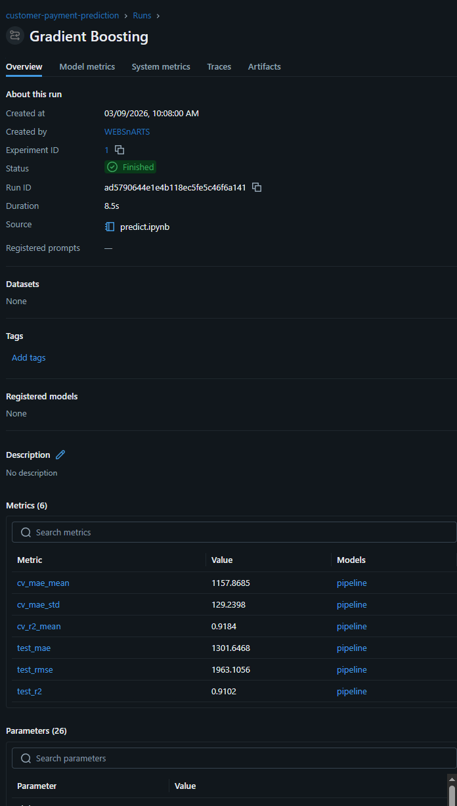

# Customer Payment Prediction – ML Pipeline

End-to-end machine learning project for predicting B2B payment values and classifying payment risk. Built to support sales teams in prioritizing high-risk accounts.

## Problem Statement

In B2B sales, late or missing payments directly impact cash flow. This project predicts the expected payment value per order and classifies orders as high/low risk – enabling proactive intervention before payment deadlines.

## Approach

1. **EDA** – distribution analysis, missing data audit, correlation heatmap, target variable inspection
2. **A/B Testing** – statistical group comparison (Mann-Whitney U, Cohen's d, Shapiro-Wilk normality test)
3. **Feature Engineering** – temporal features from order dates (month, quarter, day of week), domain-informed numeric features
4. **sklearn Pipeline** – `ColumnTransformer` for parallel preprocessing of numeric and categorical features; full pipeline prevents data leakage during cross-validation
5. **Model Selection** – Ridge (baseline), Random Forest, Gradient Boosting evaluated via 5-fold cross-validation on MAE and R²
6. **Evaluation** – hold-out test set, residuals plot, actual vs predicted scatter
7. **SHAP** – beeswarm and waterfall plots for global and per-prediction explainability
8. **Experiment Tracking** – MLflow logs parameters, metrics and artifacts for every run

## Results

| Metric | Value |
|--------|-------|
| Best model | Gradient Boosting |
| CV MAE (5-fold) | 1157.87 PLN |
| Test MAE | 1301.65 PLN |
| Test RMSE | 1963.11 PLN |
| Test R² | 0.910 |

### MLflow Dashboard



## Project Structure

```
├── predict.ipynb          # ML pipeline: EDA, A/B testing, training, SHAP, MLflow
├── app.py                 # Streamlit dashboard – batch predictions or live inference + SHAP
├── generate_test_data.py  # Generates synthetic dataset for demo purposes
├── zamowienia_testowe.csv # Sample dataset (150 orders, 9 features)
├── requirements.txt
└── README.md
```

## Quickstart

```bash
pip install -r requirements.txt

# 1. Generate sample data (or use your own zamowienia.csv)
python generate_test_data.py

# 2. Run notebook to train model and export predictions
jupyter notebook predict.ipynb

# 3. Launch dashboard
streamlit run app.py

# 4. View experiment history
mlflow ui
```

## Tech Stack

| Layer | Tools |
|-------|-------|
| Data processing | pandas, numpy |
| Statistics | scipy (Mann-Whitney U, Shapiro-Wilk, Cohen's d) |
| ML | scikit-learn (Pipeline, ColumnTransformer, GradientBoosting, RandomForest, Ridge) |
| Explainability | SHAP (TreeExplainer, beeswarm, waterfall) |
| Experiment tracking | MLflow |
| Visualization | matplotlib, seaborn |
| Dashboard | Streamlit |
| Model persistence | joblib |
