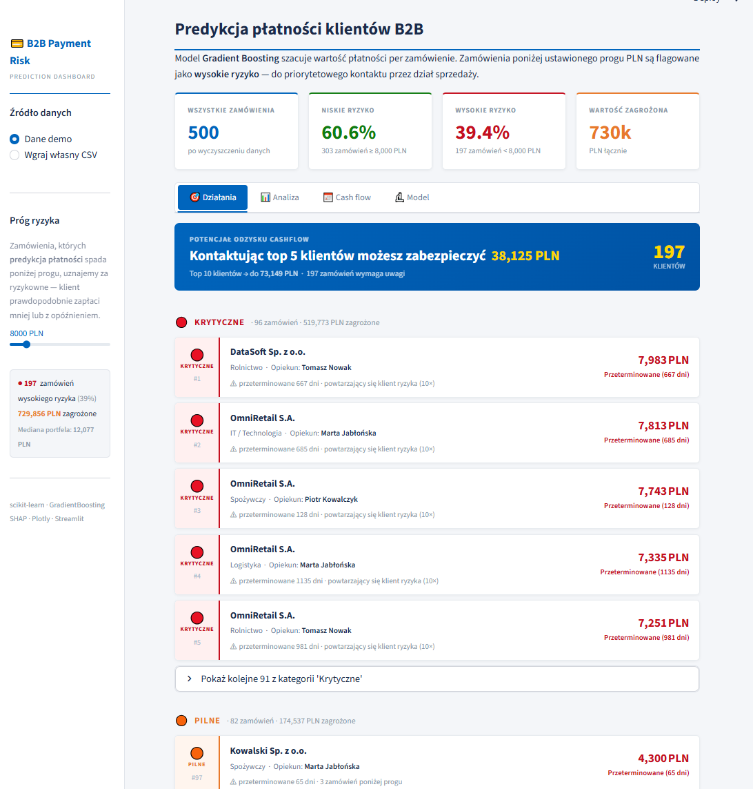
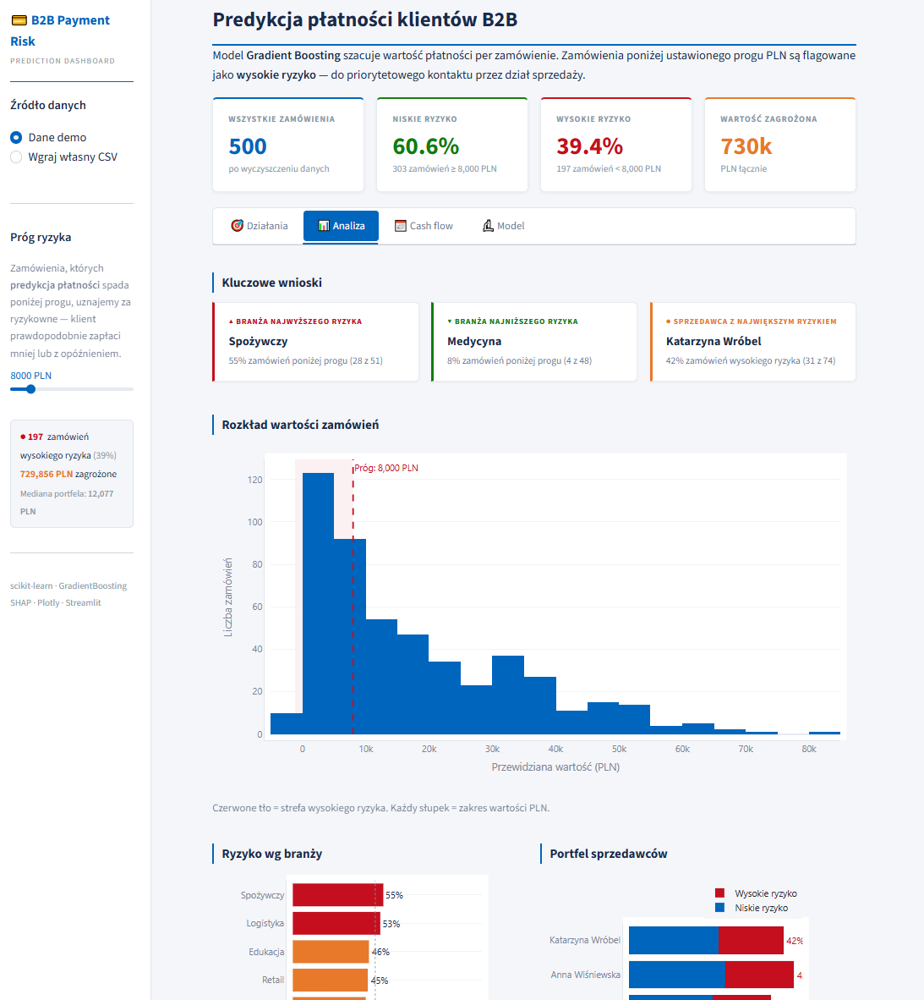
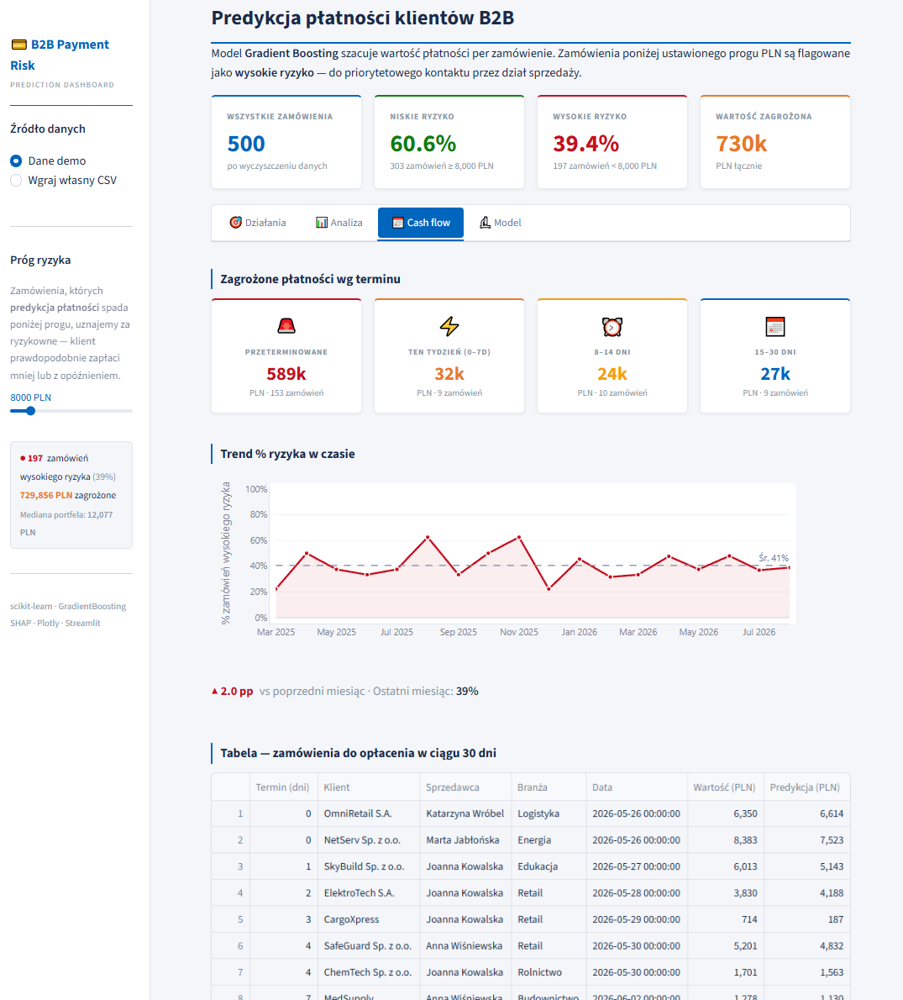
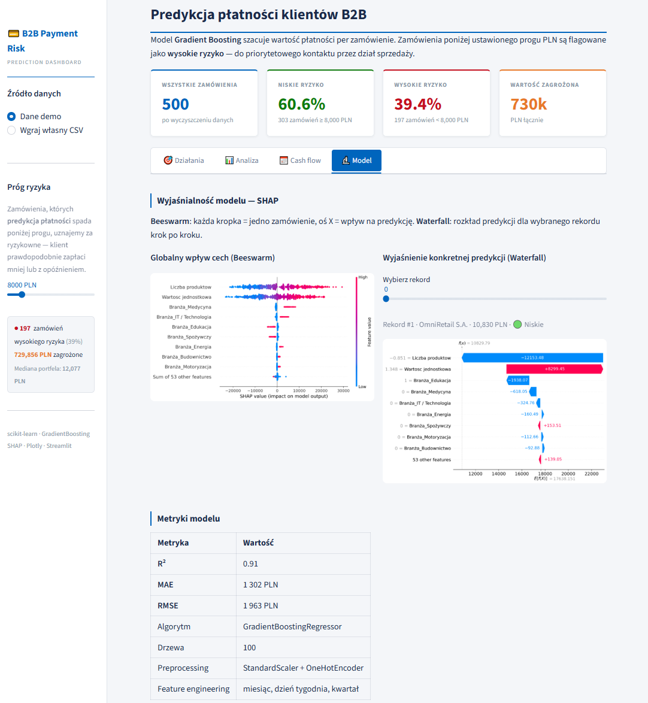

# B2B Payment Risk Dashboard

Streamlit dashboard wspierający działy sprzedaży B2B w zarządzaniu ryzykiem płatności. Firma sprzedaje na kredyt kupiecki (30 dni). Niektórzy klienci płacą mniej niż wartość faktury — model przewiduje **ile % faktury klient faktycznie zapłaci** i flaguje faktury z ryzykiem niedoboru, zanim minie termin płatności.

## Dashboard — app.py

### Jak to działa

1. Do modelu trafiają dane faktury: branża klienta, liczba produktów, cena jednostkowa, sprzedawca, miesiąc i kwartał
2. **GradientBoostingRegressor** (scikit-learn Pipeline) przewiduje `Kwota zapłacona` — ile z faktury faktycznie wpłynie
3. Wyliczane jest `% pokrycia faktury` = prognoza / wartość faktury
4. Jeśli prognoza < próg % (domyślnie 85%) → faktura dostaje flagę **ryzyka niedoboru**
5. Handlowiec widzi listę priorytetową i kontaktuje się z klientem przed terminem

### Cztery zakładki

| Zakładka | Dla kogo | Zawartość |
|----------|----------|-----------|
| 🎯 Działania | Handlowiec (codziennie) | Lista klientów do kontaktu — posortowana wg pilności i wartości |
| 📊 Analiza | Manager | Ryzyko wg branży i sprzedawcy, rozkład wartości zamówień |
| 📅 Cash flow | Finance | Harmonogram zagrożonych płatności: przeterminowane 1–30d / 31–90d / >90d + nadchodzące |
| 🔬 Model | Data science | SHAP beeswarm + waterfall, metryki modelu, surowe dane |

### 🎯 Działania



Każde zamówienie wysokiego ryzyka dostaje **Priority Score** = pilność terminu (40%) + wartość zagrożona (40%) + historia klienta (20%).

Trzy tiery: 🔴 Krytyczne · 🟠 Pilne · 🟡 Ważne. Zamówienia przeterminowane ponad 90 dni są wykluczone z listy działań (trafiają wyłącznie do bucketu "Cash flow > 90d").

### 📊 Analiza



### 📅 Cash flow



### 🔬 Model



### Stack — dashboard

| Warstwa | Narzędzia |
|---------|-----------|
| ML | scikit-learn — Pipeline, ColumnTransformer, GradientBoostingRegressor |
| Explainability | SHAP — TreeExplainer, beeswarm, waterfall |
| Wizualizacja | Plotly, matplotlib |
| Dashboard | Streamlit |
| Dane | pandas, numpy |

### Uruchomienie

```bash
pip install -r requirements.txt
streamlit run app.py
```

Aplikacja uruchamia się w trybie demo (500 syntetycznych zamówień, 40 klientów, 7 sprzedawców). Można też wgrać własny CSV przez sidebar.

---

## Notebook — predict.ipynb

Osobny artefakt: eksperymenty ML, nie powiązany z dashboardem.

- **EDA** — rozkłady, brakujące dane, korelacje
- **A/B Testing** — Mann-Whitney U, Cohen's d, Shapiro-Wilk
- **Feature engineering** — cechy temporalne z dat zamówień
- **Model selection** — Ridge (baseline), Random Forest, Gradient Boosting, 5-fold CV
- **Ewaluacja** — zbiór testowy, residuals, actual vs predicted
- **SHAP** — globalne i per-rekord wyjaśnienia
- **MLflow** — tracking parametrów, metryk i artefaktów

Wyniki notebooka (R²=0.91, MAE=1 302 PLN, RMSE=1 963 PLN) zostały ręcznie przeniesione do zakładki Model w dashboardzie jako stałe — model w `app.py` trenuje się na danych demo, nie na zbiorze z notebooka.

```bash
jupyter notebook predict.ipynb
mlflow ui
```
